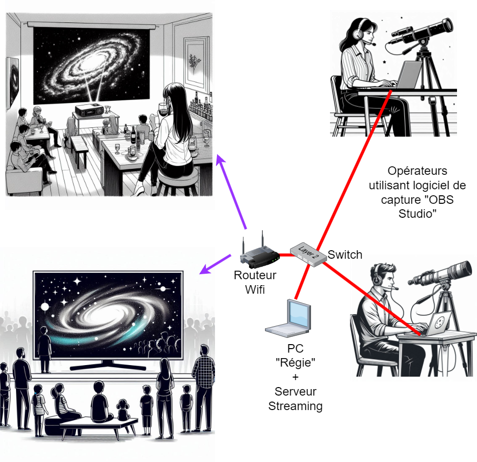

# Streaming-Nuit-des-Etoiles-2024
Projet de réseau de streaming vidéo

# Ojectifs du projet #
- Permettre à un plus grand nombre de personnes de suivre des démonstrations de visuel assisté en temps réel, avec explications audio en n'étant pas tous immédiatement autour des opérateurs.

# En pratique #
- Capturer les vidéos + webcam + son de plusieurs opérateurs
- Les diffuser alternativement sur un ou plusieurs écrans / vidéo projecteurs en quasi temp réel
- En dehors des temps forts, on pourra diffuser d'autres médias sur les écrans (par exemple des diaporamas des photos prises par les membres du club)

Techniquement, on reliera les ordinateurs des opérateurs ainsi que les écrans dans un réseau local privé (si possible Ethernet, mais avec possibilité de Wifi ou de CPL pour les écrans).

